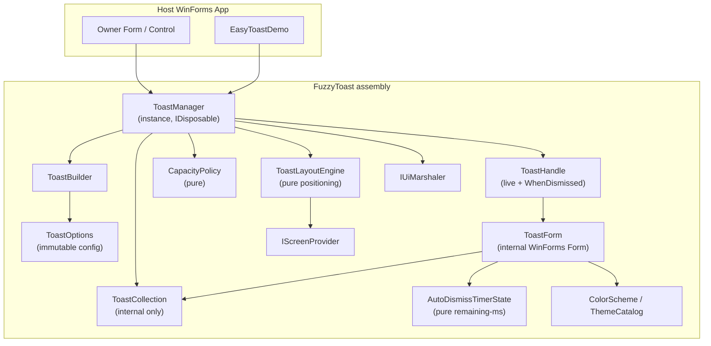
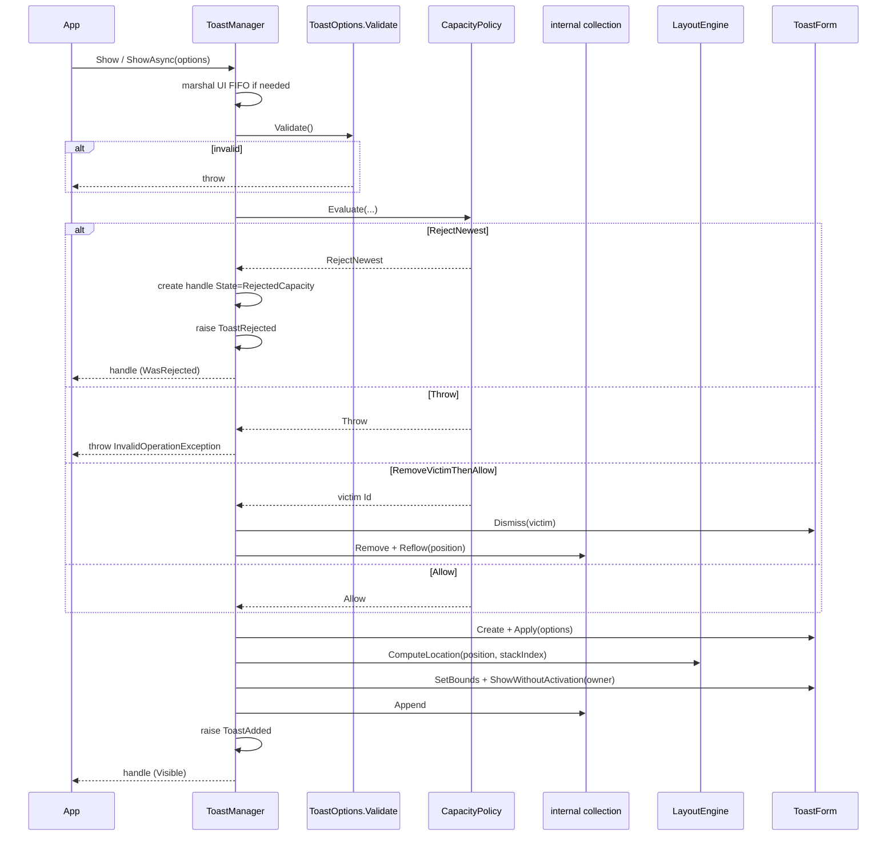
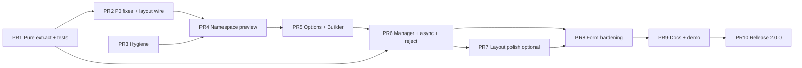

# FuzzyToast / EasyToast v2 — Technical Design Document

[Home](index.md) · [Getting started](getting-started.md) · [API reference](api-reference.md) · [Migration](migration.md) · [Design](design.md)

| Field | Value |
|-------|--------|
| **Title** | FuzzyToast v2 Refactor: Instance Manager, Builder API, Namespace Migration & xUnit Strategy |
| **Author** | (TBD) |
| **Date** | 2026-03-24 |
| **Status** | **Approved for implementation** |
| **Document revision** | **4** |
| **Target version** | 2.0.0 (any public-namespace-breaking PR ships as `2.0.0-preview.N` until stable) |
| **Package / Assembly** | `FuzzyToast` |
| **Codebase** | `C:\Users\QuocTA\source\repos\EasyToast` |
| **Stack** | .NET 8+ / Windows Forms only |

### Revision history

| Rev | Status | Notes |
|-----|--------|-------|
| 1 | Draft | Initial v2 design |
| 2 | Draft | Review feedback: ShowAsync/WhenDismissed, reject contract, CapacityPolicy, PR plan |
| **3** | **Approved for implementation** | User finals: (1) `WhenDismissed` for `RejectedCapacity` → **RanToCompletion immediately**; (2) **all four corners** in v2.0 (`TopLeft`, `TopRight`, `BottomLeft`, `BottomRight`); (3) proceed with PR Plan implementation |
| **4** | **Approved for implementation** | **Touchable UI + text spacing**: min 44×44 touch targets; content padding; caption↔description gap; taller toast defaults encoded in `ToastLayoutMetrics` |

---

## Overview

**FuzzyToast** (folder/project still named EasyToast; **folder may remain `EasyToast` for the life of v2**) is an ~8-year-old WinForms toast library, surface-migrated to `net8.0-windows`. The public NuGet/assembly name is `FuzzyToast`, but types live under the dangerous root namespace `System` (`System.UI.Widget`, `System.Enums`). The library has **zero automated tests**, multiple confirmed P0 correctness bugs, a global static manager unsafe for multi-window use, and a partial fluent builder that cannot express Theme/Position/Animation/CloseStyle despite README claims.

This document specifies a **v2 breaking refactor** that:

1. Moves all public types out of `System.*` into a proper `FuzzyToast` namespace.
2. Replaces the static `ToastManager` / `Toast.Window` / `CurrentToast` model with an **instance-based manager** scoped to an owner `Control`/`Form`.
3. Completes a first-class **builder + options** API covering Theme, Position, Animation, CloseStyle, Duration, muting, thumbnail, and custom colors (margins remain manager-level — see G3).
4. Fixes all known P0/P1 defects as part of migration, including layout reflow, max-capacity policy, hover-pause, disposal, and UI-thread marshaling.
5. Positions toasts at **all four screen corners** in v2.0 (`TopLeft`, `TopRight`, `BottomLeft`, `BottomRight`).
6. Introduces a mandatory **xUnit** test project with pure-logic extraction for layout, capacity policy, auto-dismiss timer state, colors, and collections, plus a defined STA/UI test boundary.
7. Ships via an incremental, independently mergeable **PR plan** that lands **correct layout math early** and implements **async completion in the manager PR** with fakes.

The Form-based toast UI (`FrmToast`) is retained and hardened rather than rewritten as WPF/WinUI or native Action Center toasts.

### Normative API contracts (quick reference)

These three contracts are **normative** for implementation; later sections expand them.

| Contract | Rule |
|----------|------|
| **Show / ShowAsync** | Both return a **live** `ToastHandle` after the toast is shown (or rejected). `ShowAsync`’s `Task` completes when the toast is **shown** (UI marshaled + visible, or rejected without showing). Lifetime observation uses `ToastHandle.WhenDismissed`. |
| **WhenDismissed** | Completes on transition to `Dismissed`. For **`RejectedCapacity`**, completes as **`TaskStatus.RanToCompletion` immediately** (never `Canceled` solely due to reject). Callers may always `await handle.WhenDismissed` after every show. |
| **Overflow** | Never silent: always a handle with `State == RejectedCapacity` **or** throw; always raise `ToastRejected` when rejecting. Discarded handles are **not** in `ActiveToasts`. |
| **Capacity + stack** | Per-position list ordered oldest→newest; visual `stackIndex = list index`; on add append; on remove compact + reflow. `CapacityPolicy.Evaluate` is pure and decides DropNewest / DropOldest victim / Throw. |
| **Positions (v2.0)** | **All four corners:** `TopLeft`, `TopRight`, `BottomLeft`, `BottomRight`. Each has its own stack and capacity accounting. |

---

## Background & Motivation

### Current state (verified against source)

| Area | Location | Observation |
|------|----------|-------------|
| Toast model + static `Build` overloads | `EasyToast/UI/Widget/Toast.cs` | Many static factories; `Theme`/`Position`/`CloseStyle` are `internal set` with **no public setters or Build overloads** |
| Form UI | `EasyToast/UI/Widget/frmToast.cs` + Designer | `Description` setter writes `lblCaption`; sound commented out; no hover-pause; `TopMost = true` |
| Static manager | `EasyToast/UI/Widget/ToastManager.cs` | Global collection; `CurrentToast`; max 6; layout **soft-skips** positioning when ≥3 at a corner (toast may still `Show` at constructor default location if global count &lt; 6); BottomRight uses total `Count` not per-position; **no reflow on remove** |
| Incomplete builder | `EasyToast/UI/Widget/ToastBuilder.cs` | Only Caption/Description/Duration/Muting/Thumbnail; ctor takes `IWin32Window` |
| Theme/colors | `EasyToast/UI/Widget/ThemeBuilder.cs` | Constructor params named R/B/G; getters use `FromArgb(RBg, BBg, GBg)` so second arg is green. **Builtins** pass constants in the order FromArgb effectively needs for intended RGB and look correct. **`CreateCustomScheme`** swaps G/B once and is wrong for callers |
| Enums | `EasyToast/Enums/*` | Namespace `System.Enums`; typo `CloseStye`; `Animation.SLIDE=0`, `FADE=1`, default FADE |
| Utils | `EasyToast/UI/Utils.cs` | `ValidateImageSize` uses `\|\|`; JPEG magic incomplete |
| Project | `EasyToast/EasyToast.csproj` | `RootNamespace=System`, `AssemblyName=FuzzyToast`, JetBrains.Annotations unused |
| Demo | `EasyToastDemo/` | Exercises basic builds; Theme/Position buttons incomplete (`BtnTopRight_Click` / `BtnBottom_Click` empty) |
| Tests | — | **None** |
| Legacy | `packages/`, `app.config` | .NET Framework binding redirects / Costura.Fody leftovers (SDK csproj does not reference Costura/Fody) |

### Confirmed P0 bugs (must fix in v2)

1. **Description setter bug** — `FrmToast.Description` set → `lblCaption.Text` instead of `lblDescription.Text` (`frmToast.cs` ~99–103).
2. **Missing public Theme/Position API** — Properties `internal set`; no `Toast.Build(..., Theme)` overload despite README; `ToastBuilder` lacks setters.
3. **`ShowAsync()` returns `void`** — README documents `await ...ShowAsync()`; implementation is fire-and-forget (`Toast.cs` ~99–102).
4. **`ToastCollection.Contains` always true** — compares `toast.Guid.Contains(toast.Guid)` (self) (`ToastManager.cs` ~209–221).
5. **Custom theme G/B channel bug** — `CreateCustomScheme(bg, fg)` calls `new ColorScheme(bg.R, bg.B, bg.G, …)` while getters use `Color.FromArgb(RBg, BBg, GBg)` (parameter names B/G are swapped relative to standard R,G,B). Builtin scheme literals happen to be authored so `FromArgb` receives intended R,G,B for Material-like colors; custom schemes are **single-swap broken**. Fix: standard R,G,B naming end-to-end; re-author builtins as true RGB constants.
6. **Layout / capacity** — `MAX_TOASTS_ALLOWED = 6` with **silent** `return` when full (no signal); per-corner soft max 3 means “don’t update location if ≥3” rather than hard reject (toast can still appear at `FrmToast` constructor default BottomRight if global count &lt; 6); BottomRight offset uses `ToastCollection.Count` not per-position stack index (`ToastManager.cs` ~111); remove does not reflow remaining toasts (`FrmToast_FormClosed` only `Remove`).
7. **Multi-window races** — static `Toast.Window`, `ToastManager.CurrentToast`, single global collection.

### P1 issues (in scope for v2 hardening)

- Hover does not pause auto-close timer.
- Notification sound path commented out; dead `CancellationToken` on form.
- Image panel always visible (empty gray box when no thumbnail).
- `ValidateImageSize` uses OR not AND; incomplete JPEG SOI variants.
- Typos: `CloseStye`, `CustomThem`.
- `Cancel()` throws if not yet shown (should be no-op or soft fail).
- No `IDisposable` on Toast/Form ownership of `Image`.
- No DPI awareness beyond default form AutoScale; fixed 406×110 client size.
- Focus / activation behavior unspecified (today: normal `Show(owner)`, `TopMost = true`).
- Leftover `packages/`, Framework `app.config`, unused JetBrains package.

### Why refactor now

The library is already on .NET 8 but still carries Framework-era structure and unusable public surface (README vs code). Shipping more surface-level fixes on the static/`System.*` design will deepen technical debt. v2 is the correct moment for namespace, manager model, builder completion, testability, and bug fixes together.

---

## Goals & Non-Goals

### Goals

| ID | Goal |
|----|------|
| G1 | Proper public namespace: `FuzzyToast` (leave `System.*` entirely). |
| G2 | Instance-based `ToastManager` per owner form/control; no global `CurrentToast` / static window. Recommended **one manager per owner**. |
| G3 | Complete fluent builder + immutable options covering Theme, Position, Animation, CloseStyle, Duration, muting, thumbnail, and custom colors. **Margins and toast size are manager-level** (`ToastManagerOptions`), not per-toast builder properties (unless a future 2.x adds overrides). |
| G4 | Fix all P0 bugs; address listed P1 defects during migration. **Layout P0 is not deferred past PR2 wiring** (see PR plan). |
| G5 | Correct layout algorithm with **reflow on dismiss**, explicit max-capacity policy, per-position stacking for **all four corners** (`TopLeft`, `TopRight`, `BottomLeft`, `BottomRight`). |
| G6 | Hover pauses auto-dismiss; resume on leave with **remaining ms** (not full duration reset); configurable via `PauseOnHover`. |
| G7 | Resource ownership: dispose forms, optional owned images; manager cleanup on owner close; idempotent dispose. |
| G8 | UI-thread marshaling for `Show`/`ShowAsync` when called off UI thread; marshaled work runs **FIFO** on the UI thread. |
| G9 | `ShowAsync` returns `Task<ToastHandle>` that completes when the toast is **shown** (or rejected). Dismiss observation via `WhenDismissed` (`RanToCompletion` immediately if rejected). CancellationToken on ShowAsync dismisses if still visible. |
| G10 | First-class **xUnit** project and pure-logic extraction; CI-ready `dotnet test`. |
| G11 | Incremental PR plan; **every PR leaves EasyToastDemo buildable**; README updated to real API by PR9. |
| G12 | Cleanup Framework cruft (`packages/`, obsolete deps, binding redirects). |
| G13 | Stay small and embeddable (single WinForms library assembly). |
| G14 | Overflow is never silent: reject signal via handle state + `ToastRejected` event (or Throw). |
| G15 | Toasts do **not** steal keyboard focus (`ShowWithoutActivation` / equivalent). |

### Non-Goals

| ID | Non-goal |
|----|----------|
| NG1 | WPF / WinUI / MAUI rewrite. |
| NG2 | Native Windows Action Center / COM toast notifications (may be future optional backend). |
| NG3 | Full visual regression / animation pixel testing in CI. |
| NG4 | Non-Windows platforms. |
| NG5 | Binary compatibility with v1 assemblies (source migration only, with clear table). |
| NG6 | Persisted toast history / analytics. |
| NG7 | Non-corner positions (center, custom pixel anchors, edge midpoints) — v2.0 is **four corners only**. |
| NG8 | Perfect multi-monitor edge cases beyond working-area correctness for primary + leftmost/rightmost secondary screens used for left/right corners. |
| NG9 | Full accessibility suite (narrator automation peers, high-contrast themes) in 2.0 — baseline is no focus steal + readable contrast from themes. |
| NG10 | Per-toast margin overrides in 2.0. |

---

## Proposed Design

### High-level architecture



### Layering

| Layer | Responsibility | Testability |
|-------|----------------|-------------|
| **Public API** | `ToastManager`, `ToastBuilder`, `ToastOptions`, `ToastHandle`, enums, `ColorScheme`, event args | Unit (options/builder pure); manager with fakes |
| **Domain / pure** | Layout engine, `CapacityPolicy`, `AutoDismissTimerState`, color scheme math, collection identity, duration mapping | **Fully unit-testable** (no HWND) |
| **UI** | `ToastForm` (ex-`FrmToast`), animation, WinForms timer bridge, paint, click/hover | STA/UI tests optional; timer logic via pure state |
| **Host integration** | Owner lifetime, screen bounds, `Control.BeginInvoke` marshaling | Fake `IScreenProvider` / `IUiMarshaler` |

### Target project / folder layout

```
EasyToast.slnx                          # includes library, demo, tests
EasyToast/                              # folder name may stay EasyToast
  EasyToast.csproj                      # or FuzzyToast.csproj (optional rename; non-blocking)
  ToastManager.cs
  ToastBuilder.cs
  ToastOptions.cs
  ToastHandle.cs
  ToastEvents.cs                        # ToastChangedEventArgs, ToastRejectedEventArgs
  ColorScheme.cs
  ThemeCatalog.cs
  Enums/ ...
  Layout/
    ToastLayoutEngine.cs
    ToastLayoutMetrics.cs
    CapacityPolicy.cs                   # pure capacity decisions
    IScreenProvider.cs
    WinFormsScreenProvider.cs
  Internal/
    ToastForm.cs
    ToastForm.Designer.cs
    ToastCollection.cs                  # internal
    UiMarshaler.cs
    ImageValidation.cs
    AutoDismissTimerState.cs            # pure remaining-ms controller
  Resources/...
FuzzyToast.Tests/
  ...
EasyToastDemo/                          # name may stay; always builds on every PR
```

**Decision:** Keep solution folder `EasyToast` if rename churn is high. **Must** change `RootNamespace` and public namespaces. Optional project rename to `FuzzyToast.csproj` is non-blocking; if renamed, update solution paths and test `ProjectReference` in the same PR.

### Namespace & package identity

| Item | v1 (today) | v2 (target) |
|------|------------|-------------|
| PackageId | `FuzzyToast` | `FuzzyToast` (unchanged) |
| AssemblyName | `FuzzyToast` | `FuzzyToast` |
| RootNamespace | `System` ⚠️ | `FuzzyToast` |
| Public types | `System.UI.Widget.*`, `System.Enums.*` | `FuzzyToast.*` |
| Version while breaking surface lands | 1.0.0 | **`2.0.0-preview.N`** from the first namespace/API-breaking PR; **never** publish breaking surface as 1.x |
| Stable release | — | **2.0.0** |
| TFM | `net8.0-windows` | `net8.0-windows` (minimum) |
| Folder / demo project names | EasyToast, EasyToastDemo | May remain (cosmetic) |

```xml
<!-- csproj essentials -->
<PropertyGroup>
  <TargetFramework>net8.0-windows</TargetFramework>
  <UseWindowsForms>true</UseWindowsForms>
  <RootNamespace>FuzzyToast</RootNamespace>
  <AssemblyName>FuzzyToast</AssemblyName>
  <PackageId>FuzzyToast</PackageId>
  <Version>2.0.0-preview.1</Version> <!-- bump preview.N per breaking PR; 2.0.0 at PR10 -->
  <Nullable>enable</Nullable>
  <ImplicitUsings>enable</ImplicitUsings>
  <LangVersion>latest</LangVersion>
  <GenerateDocumentationFile>true</GenerateDocumentationFile>
</PropertyGroup>
```

```csharp
[assembly: InternalsVisibleTo("FuzzyToast.Tests")]
```

**No v1 type forwarding under `System.*`.** Migration is source-level only.

---

### Public API surface

#### Enums (`FuzzyToast`)

```csharp
namespace FuzzyToast;

public enum Animation
{
    Slide = 0,  // same underlying value as v1 Animation.SLIDE
    Fade = 1    // same underlying value as v1 Animation.FADE; default remains Fade
}

public enum CloseStyle  // fixed spelling (was CloseStye)
{
    ClickEntire,
    Button,
    ButtonAndClickEntire
}

public enum Duration
{
    /// <summary>Default duration from ToastManagerOptions.ShortDurationMs (2000).</summary>
    Short = 0,
    /// <summary>Default duration from ToastManagerOptions.LongDurationMs (3000).</summary>
    Long = 1
}

/// <summary>
/// Screen corner for stacking. Named ToastPosition to avoid ambiguity.
/// v2.0 supports all four corners (user decision — not deferred to 2.1).
/// </summary>
public enum ToastPosition
{
    TopLeft,
    TopRight,
    BottomLeft,
    BottomRight
}

public enum ToastTheme
{
    Dark,
    Light,
    PrimaryLight,
    SuccessLight,
    WarningLight,
    ErrorLight,
    PrimaryDark,
    SuccessDark,
    WarningDark,
    ErrorDark,
    Custom
}

/// <summary>Behavior when the manager cannot accept another toast under capacity rules.</summary>
public enum ToastOverflowPolicy
{
    /// <summary>Reject the new toast; return handle in RejectedCapacity; raise ToastRejected (default).</summary>
    DropNewest,
    /// <summary>Dismiss the policy-selected victim, then show the new toast.</summary>
    DropOldest,
    /// <summary>Throw InvalidOperationException; do not raise ToastRejected.</summary>
    Throw
}

/// <summary>Lifecycle state of a ToastHandle.</summary>
public enum ToastHandleState
{
    /// <summary>Successfully shown and still visible (or animating in).</summary>
    Visible,
    /// <summary>Was shown and has since closed (user, timer, Dismiss, or capacity victim).</summary>
    Dismissed,
    /// <summary>Never shown — rejected by capacity policy (DropNewest) or equivalent pre-show reject.</summary>
    RejectedCapacity
}
```

**Migration note (Animation):** Enum **names** change (`SLIDE`→`Slide`, `FADE`→`Fade`) but **numeric values match v1** (`Slide=0`, `Fade=1`). Default remains Fade. README historically mixed “Fading” prose with `Animation.SLIDE` samples — fix prose in PR9.

#### ColorScheme (corrected)

```csharp
namespace FuzzyToast;

/// <summary>
/// Immutable background/foreground pair. Channels are always R,G,B in standard order.
/// </summary>
public sealed class ColorScheme : IEquatable<ColorScheme>
{
    public Color Background { get; }
    public Color Foreground { get; }

    public ColorScheme(Color background, Color foreground)
    {
        Background = background;
        Foreground = foreground;
    }

    /// <summary>Standard channel order: r, g, b for background then foreground.</summary>
    public ColorScheme(byte rBg, byte gBg, byte bBg, byte rFg, byte gFg, byte bFg)
        : this(Color.FromArgb(rBg, gBg, bBg), Color.FromArgb(rFg, gFg, bFg))
    { }

    public bool Equals(ColorScheme? other) => other is not null
        && Background.ToArgb() == other.Background.ToArgb()
        && Foreground.ToArgb() == other.Foreground.ToArgb();
}

public static class ThemeCatalog
{
    public static ColorScheme Resolve(ToastTheme theme, ColorScheme? custom = null) => theme switch
    {
        ToastTheme.Dark => new ColorScheme(33, 33, 33, 255, 255, 255),
        ToastTheme.Light => new ColorScheme(255, 255, 255, 33, 33, 33),
        ToastTheme.PrimaryLight => new ColorScheme(33, 150, 243, 255, 255, 255),
        ToastTheme.SuccessLight => new ColorScheme(76, 175, 80, 255, 255, 255),
        ToastTheme.WarningLight => new ColorScheme(255, 152, 0, 255, 255, 255),
        ToastTheme.ErrorLight => new ColorScheme(213, 0, 0, 255, 255, 255),
        ToastTheme.PrimaryDark => new ColorScheme(33, 33, 33, 33, 150, 243),
        ToastTheme.SuccessDark => new ColorScheme(33, 33, 33, 76, 175, 80),
        ToastTheme.WarningDark => new ColorScheme(33, 33, 33, 255, 152, 0),
        ToastTheme.ErrorDark => new ColorScheme(33, 33, 33, 213, 0, 0),
        ToastTheme.Custom => custom
            ?? throw new InvalidOperationException(
                "ToastTheme.Custom requires a ColorScheme. Use ToastBuilder.SetCustomColors(...)."),
        _ => throw new ArgumentOutOfRangeException(nameof(theme))
    };
}
```

Deprecate static global `ThemeBuilder.CreateCustomScheme` (process-wide mutable). Custom colors are **per-toast** via options.

#### ToastOptions (immutable configuration)

```csharp
namespace FuzzyToast;

public sealed class ToastOptions
{
    public string Caption { get; init; } = string.Empty;
    /// <summary>Optional. Empty string is allowed (v1 allowed empty description).</summary>
    public string Description { get; init; } = string.Empty;
    public Duration Duration { get; init; } = Duration.Short;
    public Animation Animation { get; init; } = Animation.Fade;
    public ToastPosition Position { get; init; } = ToastPosition.BottomRight;
    public ToastTheme Theme { get; init; } = ToastTheme.Dark;
    public ColorScheme? CustomColors { get; init; }
    public CloseStyle CloseStyle { get; init; } = CloseStyle.ButtonAndClickEntire;
    public bool IsMuted { get; init; }

    /// <summary>
    /// Thumbnail reference held as-is (not cloned). Caller must keep the image alive
    /// until the toast is dismissed unless OwnsThumbnail is true.
    /// </summary>
    public Image? Thumbnail { get; init; }

    /// <summary>
    /// If true, ToastForm disposes Thumbnail exactly once when the form closes / handle disposes.
    /// If false, library never disposes the image. Callers must not dispose early while toast is visible.
    /// </summary>
    public bool OwnsThumbnail { get; init; }

    /// <summary>Opaque host data; not used by the library. Available on ToastHandle.Options.Tag and in event args via handle.</summary>
    public object? Tag { get; init; }

    /// <summary>
    /// Always invoked by ToastManager.Show / ShowAsync after UI marshal and before capacity evaluation.
    /// Throws ArgumentException for invalid config.
    /// </summary>
    public void Validate()
    {
        if (string.IsNullOrWhiteSpace(Caption))
            throw new ArgumentException("Caption is required.", nameof(Caption));
        if (Theme == ToastTheme.Custom && CustomColors is null)
            throw new ArgumentException("CustomColors required when Theme is Custom.", nameof(CustomColors));
    }
}
```

**Immutability note:** `ToastOptions` is immutable in the C# sense (init-only properties). `Image` is a mutable GDI+ object; the options object does not deep-clone it. Ownership is solely controlled by `OwnsThumbnail`.

**Margins / size:** not on `ToastOptions`. Use `ToastManagerOptions.HorizontalMargin`, `VerticalMargin`, `ToastWidth`, `ToastHeight`.

#### ToastBuilder (complete fluent API)

```csharp
namespace FuzzyToast;

public sealed class ToastBuilder
{
    private readonly ToastManager _manager;
    // ... private fields for each option ...

    internal ToastBuilder(ToastManager manager) => _manager = manager;

    public ToastBuilder SetCaption(string caption) { /* ... */ return this; }
    public ToastBuilder SetDescription(string? description) { /* trim; null → "" */ return this; }
    public ToastBuilder SetDuration(Duration duration) { /* ... */ return this; }
    public ToastBuilder SetAnimation(Animation animation) { /* ... */ return this; }
    public ToastBuilder SetPosition(ToastPosition position) { /* ... */ return this; }
    public ToastBuilder SetTheme(ToastTheme theme) { /* ... */ return this; }
    public ToastBuilder SetCustomColors(Color background, Color foreground) { /* Theme=Custom */ return this; }
    public ToastBuilder SetCustomColors(ColorScheme scheme) { /* ... */ return this; }
    public ToastBuilder SetCloseStyle(CloseStyle style) { /* ... */ return this; }
    public ToastBuilder SetMuting(bool muted = true) { /* ... */ return this; }
    public ToastBuilder SetThumbnail(Image? image, bool ownsImage = false) { /* ... */ return this; }
    public ToastBuilder SetTag(object? tag) { /* ... */ return this; }

    /// <summary>Materialize options without showing. Does not validate until Show.</summary>
    public ToastOptions Build() => ToOptions();

    /// <summary>Validate + show. Returns live handle (Visible or RejectedCapacity).</summary>
    public ToastHandle Show() => _manager.Show(ToOptions());

    /// <summary>
    /// Validate + show asynchronously. Task completes when the toast is shown (Visible)
    /// or rejected (RejectedCapacity) — not when dismissed. Use handle.WhenDismissed for dismiss.
    /// </summary>
    public Task<ToastHandle> ShowAsync(CancellationToken cancellationToken = default)
        => _manager.ShowAsync(ToOptions(), cancellationToken);
}
```

**PR5 rule:** Builder produces **only** `ToastOptions` / calls manager methods — no dual path producing v1 `Toast`.

#### Event args (manager only)

```csharp
namespace FuzzyToast;

public sealed class ToastChangedEventArgs : EventArgs
{
    public ToastChangedEventArgs(ToastHandle toast) => Toast = toast;
    public ToastHandle Toast { get; }
}

public sealed class ToastRejectedEventArgs : EventArgs
{
    public ToastRejectedEventArgs(ToastHandle toast, ToastOptions options, string reason)
    {
        Toast = toast;
        Options = options;
        Reason = reason;
    }

    /// <summary>Handle in RejectedCapacity state (not in ActiveToasts).</summary>
    public ToastHandle Toast { get; }
    public ToastOptions Options { get; }
    /// <summary>Human-readable reason, e.g. "MaxToastsPerPosition", "MaxToasts".</summary>
    public string Reason { get; }
}
```

**Events fire only on `ToastManager`.** Internal `ToastCollection` does not expose public events. Hosts subscribe to the manager (demo migration: `_toasts.ToastAdded += (_, e) => … e.Toast.Id`).

| Event | When |
|-------|------|
| `ToastAdded` | After a toast is successfully shown and added to ActiveToasts |
| `ToastRemoved` | After a visible toast is removed (dismiss, capacity victim, manager dispose) |
| `CollectionCleared` | When ActiveToasts becomes empty — after last remove, after `DismissAll`, or after manager `Dispose` cleared all |
| `ToastRejected` | When DropNewest rejects a show (and any future pre-show reject with a handle). **Not** raised for `Throw` (exception is the signal) |

#### ToastHandle (live runtime object)

```csharp
namespace FuzzyToast;

public sealed class ToastHandle : IDisposable
{
    public string Id { get; }                       // Guid "N"
    public ToastOptions Options { get; }
    public ToastHandleState State { get; }

    public bool IsVisible => State == ToastHandleState.Visible;
    public bool IsDismissed => State == ToastHandleState.Dismissed;
    public bool WasRejected => State == ToastHandleState.RejectedCapacity;

    /// <summary>
    /// Completes when the toast transitions to Dismissed.
    /// For RejectedCapacity handles: completes as <see cref="TaskStatus.RanToCompletion"/>
    /// <b>immediately</b> (normative user decision — not Canceled). Callers may always
    /// <c>await handle.WhenDismissed</c> after every show without branching on reject.
    /// Never faults solely due to normal dismiss or capacity reject.
    /// </summary>
    public Task WhenDismissed { get; }

    /// <summary>Raised only while Visible (user interaction). Not raised on RejectedCapacity handles.</summary>
    public event EventHandler? Clicked;
    public event EventHandler? Hovered;
    /// <summary>Raised once when transitioning to Dismissed. Not raised for RejectedCapacity.</summary>
    public event EventHandler? Dismissed;

    /// <summary>
    /// Dismiss if Visible; no-op if already Dismissed or RejectedCapacity.
    /// Safe after manager dispose (no-op). Idempotent.
    /// </summary>
    public void Dismiss();

    [Obsolete("Use Dismiss(). No longer throws when not shown.")]
    public void Cancel() => Dismiss();

    /// <summary>Dismiss if needed; release owned thumbnail; unsubscribe. Idempotent.</summary>
    public void Dispose();
}
```

Static `Toast.Build(...)` overloads are **removed** from the primary API.

#### ToastManager (instance model)

```csharp
namespace FuzzyToast;

public sealed class ToastManagerOptions
{
    public int MaxToasts { get; init; } = 6;
    public int MaxToastsPerPosition { get; init; } = 3;
    public ToastOverflowPolicy OverflowPolicy { get; init; } = ToastOverflowPolicy.DropNewest;
    public int ShortDurationMs { get; init; } = 2000;
    public int LongDurationMs { get; init; } = 3000;
    public int HorizontalMargin { get; init; } = 10;
    public int VerticalMargin { get; init; } = 10;
    public int ToastWidth { get; init; } = 406;
    public int ToastHeight { get; init; } = 110;
    public bool PauseOnHover { get; init; } = true;
    public bool PlaySound { get; init; } = true;
    public bool HideImagePanelWhenEmpty { get; init; } = true;
}

public sealed class ToastManager : IDisposable
{
    /// <summary>
    /// Public constructor. owner must be non-null and not disposed.
    /// Recommended: exactly one ToastManager per owner Control for the owner's lifetime.
    /// </summary>
    public ToastManager(Control owner, ToastManagerOptions? options = null);

    /// <summary>Testability overload: owner may be null only here; screen/marshal/view injected.</summary>
    internal ToastManager(
        Control? owner,
        ToastManagerOptions options,
        IScreenProvider screenProvider,
        IUiMarshaler marshaler,
        Func<ToastOptions, IToastView> viewFactory);

    public Control Owner { get; }  // non-null for public ctor
    public ToastManagerOptions Options { get; }
    public IReadOnlyList<ToastHandle> ActiveToasts { get; }  // Visible only
    public int Count => ActiveToasts.Count;
    public bool IsDisposed { get; }

    public event EventHandler<ToastChangedEventArgs>? ToastAdded;
    public event EventHandler<ToastChangedEventArgs>? ToastRemoved;
    public event EventHandler? CollectionCleared;
    public event EventHandler<ToastRejectedEventArgs>? ToastRejected;

    public ToastBuilder Create();

    /// <summary>
    /// Validate → capacity → show. Returns live handle (Visible) or rejected handle (RejectedCapacity).
    /// Throws on Validate failure, Throw policy, or disposed manager/owner.
    /// </summary>
    public ToastHandle Show(ToastOptions options);

    /// <summary>
    /// Same as Show, but: (1) marshals to UI if needed; (2) Task completes when handle is
    /// Visible or RejectedCapacity (i.e. after show attempt finishes), NOT when dismissed.
    /// If cancellationToken fires while Visible, Dismiss() is called.
    /// For RejectedCapacity, Task completes with that handle immediately after reject.
    /// </summary>
    public Task<ToastHandle> ShowAsync(ToastOptions options, CancellationToken cancellationToken = default);

    public void DismissAll();

    /// <summary>Idempotent. Dismisses all active toasts, unsubscribes owner, clears collection.</summary>
    public void Dispose();
}
```

##### Lifetime contract

| Rule | Specification |
|------|----------------|
| **Cardinality** | **Recommended: one `ToastManager` per owner.** Multiple managers on the same owner are **allowed but discouraged**: each maintains an independent stack and will **overlap** screen corners (no cross-manager coordination). No static registry / throw on second instance. |
| **Owner type** | Public API requires `Control` (provides `Invoke`, `Disposed`, `IsHandleCreated`, DPI). v1 `IWin32Window`-only owners are not supported on the public ctor; hosts with only `IWin32Window` should pass a `Control` that implements it (typical `Form`). |
| **Owner null** | Public ctor: `ArgumentNullException`. Internal test ctor may pass `null` owner with fakes. |
| **Owner disposed** | Manager subscribes to `owner.Disposed` and calls `Dispose()` on itself. |
| **Manager Dispose** | Idempotent. Second call is no-op. Dismisses all Visible handles; raises remove/clear events as appropriate; sets `IsDisposed`. |
| **Handle after manager dispose** | `Dismiss` / `Dispose` on handles are no-ops if already closed; `State` remains terminal; `WhenDismissed` already completed. |
| **Double dispose of handle** | Idempotent. |
| **Show after dispose** | Throws `ObjectDisposedException`. |
| **Form.Show** | Use modeless show **without activation** (see Focus). Owner is passed as `IWin32Window` when handle created. Minimized/hidden owner: toast still shows topmost on screen working area (v1 behavior preserved; document). |
| **Thread safety** | Public methods are safe to call from any thread. Work is marshaled to the UI thread and executed **FIFO** (order of marshal queue). Concurrent `Show` calls from multiple threads appear in queue order; no additional lock-free guarantees across processes. |

#### Capacity & stacking (normative)

##### Stack model

- Per manager, maintain an **ordered list per `ToastPosition`** (four independent stacks: TopLeft, TopRight, BottomLeft, BottomRight): index `0` = **oldest** still visible at that corner; last index = **newest**.
- Visual slot: `stackIndex == list index`.
- **TopLeft / TopRight:** index 0 at top margin; higher indices stack **downward**.
- **BottomLeft / BottomRight:** index 0 at bottom margin; higher indices stack **upward**.
- Horizontal anchor: **Left** corners use `area.Left + h`; **Right** corners use `area.Right - w - h`.
- **On add (after capacity allows):** append to that position’s list; place at `stackIndex = Count-1`.
- **On remove:** remove from list; re-index remaining `0..n-1`; assign locations via `ToastLayoutEngine` (snap reflow in 2.0).
- Global `ActiveToasts` is the union of all position lists (order unspecified for global enumeration; per-position order is normative for layout).

##### CapacityPolicy (pure type)

```csharp
namespace FuzzyToast.Layout;

public enum CapacityConstraint
{
    None,
    PerPosition,
    Global
}

public enum CapacityAction
{
    /// <summary>Proceed to show without removing anyone.</summary>
    Allow,
    /// <summary>Do not show the new toast (DropNewest).</summary>
    RejectNewest,
    /// <summary>Remove VictimId then show the new toast (DropOldest).</summary>
    RemoveVictimThenAllow,
    /// <summary>Caller must throw InvalidOperationException.</summary>
    Throw
}

public sealed record CapacityDecision(
    CapacityAction Action,
    CapacityConstraint TriggeredBy,
    string? VictimId,           // Active toast Id when RemoveVictimThenAllow
    string Reason);

/// <summary>
/// Pure capacity evaluation. No UI. Active toast identities are (Id, Position, Sequence).
/// Sequence is monotonic per manager for global oldest; within a position, list order is oldest-first.
/// </summary>
public static class CapacityPolicy
{
    public static CapacityDecision Evaluate(
        ToastOverflowPolicy policy,
        int maxToasts,
        int maxToastsPerPosition,
        ToastPosition incomingPosition,
        IReadOnlyList<(string Id, ToastPosition Position)> activeOldestFirstGlobal)
    {
        // Normative algorithm:
        // Let perPos = count where Position == incomingPosition
        // Let global = activeOldestFirstGlobal.Count
        //
        // 1. If perPos >= maxToastsPerPosition:
        //      constraint = PerPosition
        //      victim = oldest among active with Position == incomingPosition
        //      (first match scanning activeOldestFirstGlobal)
        // 2. Else if global >= maxToasts:
        //      constraint = Global
        //      victim = activeOldestFirstGlobal[0]  // global oldest
        // 3. Else:
        //      return Allow
        //
        // Then map policy:
        //   DropNewest → RejectNewest (VictimId null)
        //   DropOldest → RemoveVictimThenAllow (VictimId = victim)
        //   Throw      → Throw
        //
        // If DropOldest but no victim found (should not happen if counts consistent): Throw.
    }
}
```

**Why this order:** Per-position limit is the tighter UX constraint for a given corner; enforce it first so a full TopRight stack does not evict BottomRight toasts. Global max then prevents unbounded multi-corner growth (e.g. 3+3 with max 6 already full).



#### Layout engine (pure)

```csharp
namespace FuzzyToast.Layout;

public readonly record struct Rect(int X, int Y, int Width, int Height);
public readonly record struct ScreenWorkingArea(int Left, int Top, int Right, int Bottom);

public interface IScreenProvider
{
    ScreenWorkingArea GetWorkingAreaNear(Rect hint);
    /// <summary>Working area of the rightmost screen (for TopRight/BottomRight default anchoring).</summary>
    ScreenWorkingArea GetRightmostWorkingArea();
    /// <summary>Working area of the leftmost screen (for TopLeft/BottomLeft default anchoring).</summary>
    ScreenWorkingArea GetLeftmostWorkingArea();
}

public sealed class ToastLayoutMetrics
{
    public required int ToastWidth { get; init; }
    public required int ToastHeight { get; init; }
    public required int HorizontalMargin { get; init; }
    public required int VerticalMargin { get; init; }

    // --- Touchable / content spacing (v2 UI contract; used by ToastForm) ---
    /// <summary>Minimum interactive target (close button, clickable chrome). WCAG/Material-aligned.</summary>
    public int MinTouchTargetPx { get; init; } = 44;
    public int CloseButtonSize { get; init; } = 44;
    public int ThumbnailSize { get; init; } = 96;
    public int ContentPaddingLeft { get; init; } = 16;
    public int ContentPaddingRight { get; init; } = 12;
    public int ContentPaddingTop { get; init; } = 12;
    public int ContentPaddingBottom { get; init; } = 12;
    /// <summary>Vertical gap between caption and description (must not look cramped).</summary>
    public int CaptionDescriptionGap { get; init; } = 8;
    public int CaptionMinHeight { get; init; } = 32;
    public int DescriptionMinHeight { get; init; } = 40;
    /// <summary>Gap between stacked toasts; defaults to VerticalMargin when 0.</summary>
    public int StackGap { get; init; } = 12;

    /// <summary>
    /// Default metrics for 96 DPI: roomy text, touchable close, not cramped.
    /// ToastHeight must fit padding + caption + gap + description (+ optional thumbnail column).
    /// </summary>
    public static ToastLayoutMetrics Default { get; } = new()
    {
        ToastWidth = 420,
        ToastHeight = 140,
        HorizontalMargin = 16,
        VerticalMargin = 12,
        MinTouchTargetPx = 44,
        CloseButtonSize = 44,
        ThumbnailSize = 96,
        ContentPaddingLeft = 16,
        ContentPaddingRight = 12,
        ContentPaddingTop = 12,
        ContentPaddingBottom = 12,
        CaptionDescriptionGap = 8,
        CaptionMinHeight = 32,
        DescriptionMinHeight = 40,
        StackGap = 12
    };

    /// <summary>Effective spacing between stacked toast tops (or bottoms).</summary>
    public int EffectiveStackStride => ToastHeight + (StackGap > 0 ? StackGap : VerticalMargin);
}

public static class ToastLayoutEngine
{
    /// <summary>
    /// stackIndex 0 = oldest at the anchor corner; larger index = further from the corner.
    /// Coordinates are in the same pixel space as ScreenWorkingArea (typically device pixels
    /// from WinForms Screen APIs; see DPI notes).
    /// </summary>
    public static Point ComputeLocation(
        ToastPosition position,
        int stackIndex,
        ToastLayoutMetrics metrics,
        ScreenWorkingArea area)
    {
        var h = metrics.HorizontalMargin;
        var v = metrics.VerticalMargin;
        var w = metrics.ToastWidth;
        var th = metrics.ToastHeight;
        var stride = metrics.EffectiveStackStride;

        // Horizontal: Left corners → Left+h; Right corners → Right-w-h
        // Vertical:   Top corners  → Top+v + stack*stride
        //             Bottom corners → Bottom-th-v - stack*stride
        return position switch
        {
            ToastPosition.TopLeft => new Point(
                area.Left + h,
                area.Top + v + stackIndex * stride),
            ToastPosition.TopRight => new Point(
                area.Right - w - h,
                area.Top + v + stackIndex * stride),
            ToastPosition.BottomLeft => new Point(
                area.Left + h,
                area.Bottom - th - v - stackIndex * stride),
            ToastPosition.BottomRight => new Point(
                area.Right - w - h,
                area.Bottom - th - v - stackIndex * stride),
            _ => throw new ArgumentOutOfRangeException(nameof(position))
        };
    }

    public static IReadOnlyList<Point> ComputeStack(
        ToastPosition position,
        int count,
        ToastLayoutMetrics metrics,
        ScreenWorkingArea area)
    {
        var list = new Point[count];
        for (var i = 0; i < count; i++)
            list[i] = ComputeLocation(position, i, metrics, area);
        return list;
    }
}
```

**Bug fix vs v1 BottomRight:** use per-position `stackIndex`, never global collection count.

#### Auto-dismiss timer (pure + UI bridge)

v1 uses 1-second ticks and `_counter` 2/3 — coarse and not true ms. v2:

```csharp
namespace FuzzyToast.Internal;

/// <summary>
/// Pure auto-dismiss controller. UI layer supplies "now" and a one-shot timer.
/// </summary>
public sealed class AutoDismissTimerState
{
    public int TotalDurationMs { get; }
    public int RemainingMs { get; private set; }
    public bool IsPaused { get; private set; }
    public bool IsExpired => RemainingMs <= 0;

    public AutoDismissTimerState(int totalDurationMs)
    {
        if (totalDurationMs < 1) throw new ArgumentOutOfRangeException(nameof(totalDurationMs));
        TotalDurationMs = totalDurationMs;
        RemainingMs = totalDurationMs;
    }

    /// <summary>Call when toast becomes Visible and timer should start.</summary>
    public int StartOrResume() 
    {
        IsPaused = false;
        return Math.Max(RemainingMs, 1);
    }

    /// <summary>On mouse enter when PauseOnHover. Freeze remaining based on elapsed since last arm.</summary>
    public void Pause(int elapsedSinceArmMs)
    {
        if (IsPaused) return;
        RemainingMs = Math.Max(0, RemainingMs - Math.Max(0, elapsedSinceArmMs));
        IsPaused = true;
    }

    /// <summary>On mouse leave. Returns interval for one-shot UI timer.</summary>
    public int Resume()
    {
        IsPaused = false;
        return Math.Max(RemainingMs, 1);
    }

    /// <summary>Timer fired: mark expired.</summary>
    public void OnTimerElapsed()
    {
        RemainingMs = 0;
        IsPaused = false;
    }
}
```

**UI bridge (ToastForm):**

1. Map `Duration.Short/Long` → `manager.Options.ShortDurationMs/LongDurationMs`.
2. Create `AutoDismissTimerState(durationMs)`.
3. Arm a **one-shot** `System.Windows.Forms.Timer` with `Interval = state.StartOrResume()`; on Tick → `OnTimerElapsed()` → `BeginDismiss()`.
4. If `PauseOnHover`: MouseEnter → stop timer, `Pause(elapsedMs)` using `Environment.TickCount64` (or `Stopwatch`) since last arm; MouseLeave → `Interval = Resume()`, restart timer.
5. Do **not** reset to full duration on leave.

#### Toast lifecycle

```mermaid
stateDiagram-v2
  [*] --> Configured: Builder / ToastOptions
  Configured --> RejectedCapacity: CapacityPolicy RejectNewest
  Configured --> Showing: Capacity Allow / after victim removed
  Showing --> Visible: Form shown without activation + timer arm
  Visible --> Paused: Hover PauseOnHover
  Paused --> Visible: MouseLeave resume remaining
  Visible --> Closing: Timer / Dismiss / Click / Button / victim
  Paused --> Closing: Explicit Dismiss
  Closing --> Dismissed: Animation complete
  Dismissed --> [*]: Remove + Reflow + events; WhenDismissed completes
  RejectedCapacity --> [*]: ToastRejected; WhenDismissed RanToCompletion immediately
```



**ShowAsync semantics (normative)**

```csharp
// Completes when shown OR rejected — handle is live either way
ToastHandle h = await manager.ShowAsync(options, ct);
if (h.WasRejected) { /* capacity */ return; }

h.Clicked += ...;
// Wait for dismiss separately:
await h.WhenDismissed;

// Or fire-and-forget show:
_ = manager.Create().SetCaption("Hi").ShowAsync();
```

| API | Task completes when | Returns |
|-----|---------------------|---------|
| `Show` | (sync, after show/reject) | Live `ToastHandle` |
| `ShowAsync` | Toast **shown** (Visible) or **rejected** (RejectedCapacity) | Same handle |
| `WhenDismissed` | Transition to Dismissed; **RejectedCapacity → RanToCompletion immediately** | `Task` |

Cancellation on `ShowAsync`: if token fires before show completes, cancel the show attempt if possible; if already Visible, call `Dismiss()`. Register token callback carefully (UI marshal).

#### ToastForm (internal UI)

Rename `FrmToast` → `ToastForm` (internal).

| Concern | Behavior |
|---------|----------|
| Caption / Description | Correct labels; theme colors on **both** labels + close button |
| Thumbnail | Reference as-is; dispose iff `OwnsThumbnail`; if null and `HideImagePanelWhenEmpty`, collapse image panel |
| CloseStyle | Three modes; panel collapse for `ClickEntire` |
| Animation | Keep `AnimateWindow` slide + opacity fade |
| Sound | Optional when `PlaySound && !IsMuted` |
| Hover | Bridge to `AutoDismissTimerState` |
| Theme | `ThemeCatalog.Resolve` |
| Closed | Notify manager → remove + reflow; complete handle `WhenDismissed` |
| **Focus** | **Must not steal activation.** Prefer `ShowWithoutActivation` pattern (override `ShowWithoutActivation` → true, and/or `SetWindowPos` / native show flags as needed). Do not call APIs that force foreground. `TopMost = true` may remain for visibility. |
| **DPI** | Keep `AutoScaleMode = Font` as today. Metrics from `ToastLayoutMetrics` (default 420×140). Optional later scale by `owner.DeviceDpi / 96f`. Manual DPI checklist in PR9 (100% / 150% / 200%). |
| **Touchable UI** | See subsection below — normative for PR1 form polish and PR8. |

##### Touchable UI & text spacing (normative UX)

Toast is often used on touch-capable Windows tablets / hybrid devices. The UI **must** be finger-friendly and text must not look cramped.

| Rule | Spec (defaults @ 96 DPI via `ToastLayoutMetrics.Default`) |
|------|-----------------------------------------------------------|
| **Min touch target** | Interactive controls (close button) ≥ **44×44** px; hit-test padding if visual glyph is smaller |
| **Close button** | Size = `CloseButtonSize` (44); right padding from edge ≥ 8; cursor `Hand`; flat style OK |
| **Toast size** | Default **420×140** (was 406×110) — extra height for vertical breathing room |
| **Content padding** | Left ≥ 16, Top/Bottom ≥ 12, Right ≥ 12 (between text and close) |
| **Caption ↔ description** | Vertical gap ≥ **8** px (`CaptionDescriptionGap`); do **not** stack labels with 0–2 px padding only |
| **Caption** | Min height ≥ 32; Segoe UI **10pt Bold**; `AutoEllipsis`; padding left aligned with description |
| **Description** | Min height ≥ 40 when present; Segoe UI **9pt** Regular; padding; `AutoEllipsis` / word wrap as appropriate |
| **Click-to-dismiss** | Entire toast body remains a large touch target when `CloseStyle` includes click-entire |
| **Thumbnail column** | ~96 px; collapse when empty; no gray empty strip |
| **Stack gap** | `StackGap` (12) between toasts so stacked cards are separable by touch |
| **No overlapping text** | Caption and description rects must not overlap; close button must not cover caption text (caption right margin ≥ close size + gap) |

**KD27:** Touchable defaults and spacing are first-class in `ToastLayoutMetrics`, not ad-hoc designer magic numbers.

```
┌──────────────────────────────────────────────────────┐
│ [thumb 96]  │  Caption (10pt bold)          [ × 44 ] │
│             │  ↕ gap ≥ 8                             │
│             │  Description (9pt) multi-line…         │
│  padding    │  padding L16 / T12 / B12 / R12         │
└──────────────────────────────────────────────────────┘
  total height ≥ 140; width ≥ 420 @ 96 DPI
```

```csharp
internal interface IToastView : IDisposable
{
    ToastHandle Handle { get; }
    void Apply(ToastOptions options, ColorScheme scheme, int durationMs, bool pauseOnHover);
    void SetBounds(Rectangle bounds);
    void Show(IWin32Window? owner);  // without activation
    void BeginDismiss();
    bool IsDisposed { get; }
    event EventHandler? Closed;      // manager wires WhenDismissed + collection
}
```

#### Collection (internal)

```csharp
// Internal only — no public ToastCollection type in v2.
// Manager exposes IReadOnlyList<ToastHandle> ActiveToasts.

// Identity:
bool Contains(ToastHandle item) => item is not null && _list.Exists(t => t.Id == item.Id);
```

---

### Data Model Changes

| Entity | v1 | v2 |
|--------|----|----|
| Toast config | Mutable properties on `Toast` | Immutable `ToastOptions` |
| Runtime instance | `Toast` + `FrmToast` | `ToastHandle` + internal `ToastForm` |
| Manager state | Static singleton collection | Per-instance internal collection |
| Custom theme | Static `ThemeBuilder.CustomScheme` | Per-options `ColorScheme` |
| Identity | string Guid | `ToastHandle.Id` |
| Handle state | implicit | `ToastHandleState` |
| Capacity | hard-coded constants + silent return | `CapacityPolicy` + options + events |

---

### API / Interface Changes (before → after)

#### Minimal show

```csharp
// v1
using System.UI.Widget;
Toast.Build(this, "Hello").Show();

// v2
using FuzzyToast;
private readonly ToastManager _toasts;
// ctor: _toasts = new ToastManager(this);
// FormClosed/Dispose: _toasts.Dispose();
_toasts.Create().SetCaption("Hello").Show();
```

#### Theme + position

```csharp
_toasts.Create()
    .SetCaption("Hello")
    .SetTheme(ToastTheme.Light)
    .SetPosition(ToastPosition.TopRight)
    .SetAnimation(Animation.Slide)
    .SetCloseStyle(CloseStyle.Button)
    .SetDuration(Duration.Long)
    .Show();
```

#### Async (live handle + WhenDismissed)

```csharp
// v1 (misleading — ShowAsync is void)
await Toast.Build(this, "Hello", Duration.LENGTH_SHORT).ShowAsync();

// v2 — await show, then optionally await dismiss
ToastHandle h = await _toasts.Create()
    .SetCaption("Hello")
    .SetDuration(Duration.Short)
    .ShowAsync();

if (!h.WasRejected)
{
    h.Clicked += (_, _) => { /* ... */ };
    await h.WhenDismissed;
}
```

#### Custom colors

```csharp
_toasts.Create()
    .SetCaption("Custom")
    .SetCustomColors(Color.FromArgb(40, 40, 60), Color.White)
    .SetTag(myContext)
    .Show();
```

#### Events

```csharp
_toasts.ToastAdded += (_, e) => log($"shown {e.Toast.Id} tag={e.Toast.Options.Tag}");
_toasts.ToastRemoved += (_, e) => log($"gone {e.Toast.Id}");
_toasts.ToastRejected += (_, e) => log($"rejected {e.Reason}");
_toasts.CollectionCleared += (_, _) => log("empty");
```

---

## Compatibility Strategy

| Approach | Choice |
|----------|--------|
| Binary compatible v1 | **No** |
| Type forwarders `System.*` | **No** |
| Obsolete shims in same assembly | **No** by default |
| Source migration guide + demo rewrite | **Yes** |
| Major version | **2.0.0** (previews `2.0.0-preview.N` while breaking PRs land) |

### Breaking changes table

| v1 | v2 | Notes |
|----|----|-------|
| Namespace `System.UI.Widget` | `FuzzyToast` | Update usings |
| Namespace `System.Enums` | `FuzzyToast` | Enums co-located |
| `CloseStye` | `CloseStyle` | Typo fix |
| `Position` (TopRight, BottomRight only) | `ToastPosition` (TopLeft, TopRight, BottomLeft, BottomRight) | Rename + **two new corners** in v2.0 |
| `Theme` | `ToastTheme` | Rename |
| `Duration.LENGTH_SHORT/LONG` | `Duration.Short/Long` | Naming |
| `Animation.FADE/SLIDE` | `Animation.Fade/Slide` | Names change; **values 1/0 unchanged** |
| Static `Toast.Build` | `manager.Create()` / `Show(options)` | Removed |
| `new ToastBuilder(IWin32Window)` | `manager.Create()` | Builder is manager-owned; no public window-only ctor |
| Static `ToastManager` | Instance `new ToastManager(Control)` | Required |
| `ToastManager.MAX_TOASTS_ALLOWED` | `ToastManagerOptions.MaxToasts` | Relocated |
| Public `ToastCollection` + mutable `ICollection` | Internal collection; `ActiveToasts` read-only | Events on manager only |
| `Toast.OnClick` / `OnHover` / `OnClosed` | `ToastHandle.Clicked` / `Hovered` / `Dismissed` | Rename |
| `Toast.ShowAsync(): void` | `Task<ToastHandle> ShowAsync` completes on **show**; `WhenDismissed` for dismiss | |
| `Toast.Cancel()` throws if not shown | `Dismiss()` no-op | Softer |
| `Toast.CustomThem` | `ToastOptions.CustomColors` | |
| `ThemeBuilder.CreateCustomScheme` static | Per-toast `SetCustomColors` | |
| `RootNamespace = System` | `FuzzyToast` | |
| JetBrains.Annotations | Removed | |

### Suggested consumer migration steps

1. Bump package to `FuzzyToast` `2.0.0` or `2.0.0-preview.N`.
2. Replace usings.
3. Create one `ToastManager` field on main form; dispose with form.
4. Replace `Toast.Build(...).Show()` with `manager.Create()...Show()`.
5. Replace `await ShowAsync()` with live-handle pattern + optional `WhenDismissed`.
6. Wire events on the manager instance (`ToastAdded` etc.).
7. Map `MAX_TOASTS_ALLOWED` usage to options.
8. Delete hacks that set internal Theme/Position.

---

## Unit Testing (xUnit) Strategy

### Test project layout

```
FuzzyToast.Tests/
  FuzzyToast.Tests.csproj
  Layout/
    ToastLayoutEngineTests.cs
    CapacityPolicyTests.cs
  Timer/
    AutoDismissTimerStateTests.cs
  ColorScheme/
    ColorSchemeTests.cs
    ThemeCatalogTests.cs
  Collection/
    ToastCollectionTests.cs
  Builder/
    ToastBuilderTests.cs
    ToastOptionsTests.cs
  Manager/
    ToastManagerShowTests.cs
    ToastManagerOverflowTests.cs
    ToastManagerReflowTests.cs
    ToastManagerLifetimeTests.cs
    ToastManagerAsyncTests.cs
  Validation/
    ImageValidationTests.cs
  Support/
    FakeScreenProvider.cs
    FakeUiMarshaler.cs      // records Invoke order; InvokeRequired configurable
    FakeToastView.cs         // raises Closed on BeginDismiss; no HWND
    StaFact helpers
```

**PR1 Definition of Done:** solution (`EasyToast.slnx` including `FuzzyToast.Tests`) **builds** on Windows; `dotnet test EasyToast.slnx` **green** for pure tests; no UI trait required for green mainline.

```xml
<Project Sdk="Microsoft.NET.Sdk">
  <PropertyGroup>
    <TargetFramework>net8.0-windows</TargetFramework>
    <UseWindowsForms>true</UseWindowsForms>
    <IsPackable>false</IsPackable>
    <Nullable>enable</Nullable>
    <RootNamespace>FuzzyToast.Tests</RootNamespace>
  </PropertyGroup>
  <ItemGroup>
    <PackageReference Include="Microsoft.NET.Test.Sdk" Version="17.*" />
    <PackageReference Include="xunit" Version="2.*" />
    <PackageReference Include="xunit.runner.visualstudio" Version="2.*" />
    <PackageReference Include="Xunit.StaFact" Version="1.*" />
    <PackageReference Include="coverlet.collector" Version="6.*" />
  </ItemGroup>
  <ItemGroup>
    <ProjectReference Include="..\EasyToast\EasyToast.csproj" />
  </ItemGroup>
</Project>
```

### Pure logic (must unit-test without UI)

| Component | Tests prove |
|-----------|-------------|
| `ToastLayoutEngine` | All four corners (TL/TR/BL/BR); stack growth; margins; multi-count; independent stacks |
| `CapacityPolicy.Evaluate` | Per-position first, then global; DropNewest/DropOldest/Throw; victim ids |
| `AutoDismissTimerState` | Pause reduces remaining; resume returns remaining not full; expire |
| `ColorScheme` / `ThemeCatalog` | R,G,B order; PrimaryLight; Custom null throws |
| Internal collection | Contains by Id; add/remove |
| `ToastOptions.Validate` | Empty caption; Custom without colors; empty description allowed |
| `ToastBuilder.Build` | All setters map; chaining |
| `ImageValidation` | AND size; JPEG `FF D8 FF` variants |

### Manager tests with fakes

| Test | Expectation |
|------|-------------|
| Show adds to ActiveToasts | Count == 1; State Visible |
| Show empty caption | Throws before view create |
| DropNewest at capacity | Count unchanged; WasRejected; ToastRejected fired; not in ActiveToasts |
| DropOldest | Victim dismissed; new Visible; reflow indices |
| Throw | Throws; no ToastRejected |
| ShowAsync completes on **show** | Task completes while view still open; handle.IsVisible |
| WhenDismissed | Completes when FakeToastView.Closed fires |
| ShowAsync + reject | Task completes with WasRejected; WhenDismissed is RanToCompletion immediately |
| ShowAsync cancellation | Dismiss while Visible |
| Dispose idempotent | Second Dispose no throw; Show throws ObjectDisposedException |
| Marshal FIFO | Two off-thread Shows → Invoke order preserved |
| Reflow after middle remove | Remaining locations match engine |

### Headless / null owner

- Prefer **internal ctor** with `owner: null`, `FakeUiMarshaler` (`InvokeRequired = false`), `FakeToastView` — **no real Control**.
- Do **not** rely on `new Control()` without creating handle for production paths; if a test needs a Control, create on STA thread and `CreateControl()` only in `[StaFact]` tests.
- `NullOwnerControl` naming in folder Support is a **FakeToastView + null owner** pattern, not a magic Control subclass.

### STA / UI tests (selective)

| Area | Approach |
|------|----------|
| Description/Caption labels | `[StaFact]` smoke |
| Theme colors applied | STA |
| Image panel collapsed | STA |
| Hover pause | Prefer pure `AutoDismissTimerState` tests; STA hover optional/trait UI |

### Initial test matrix

| ID | Area | Case | Priority |
|----|------|------|----------|
| T01 | ColorScheme | `(10,20,30,40,50,60)` → BG (10,20,30) | P0 |
| T02 | ThemeCatalog | PrimaryLight BG (33,150,243) | P0 |
| T03 | ThemeCatalog | Custom null throws | P0 |
| T04 | Collection | Contains false different Id | P0 |
| T05 | Collection | Contains true same Id | P0 |
| T06 | Layout | BottomRight index 0 at bottom | P0 |
| T07 | Layout | BottomRight index 1 one slot up | P0 |
| T08 | Layout | TopRight grows down | P0 |
| T09 | Layout | BR stack ignores other position counts | P0 |
| T09b | Layout | TopLeft index 0 at top-left anchor | P0 |
| T09c | Layout | BottomLeft stack grows up from bottom-left | P0 |
| T09d | Layout | All four corners independent stacks | P0 |
| T10 | Capacity | Per-position full → DropNewest reject | P0 |
| T11 | Capacity | Global full, per-pos free → DropOldest global oldest | P0 |
| T12 | Capacity | Per-pos full → DropOldest victim in **same** position | P0 |
| T13 | Builder | Theme/Position in options | P0 |
| T14 | Options | Empty caption throws; empty description ok | P0 |
| T15 | Manager | ShowAsync completes on show while still Visible | P0 |
| T15b | Manager | WhenDismissed completes on Closed | P0 |
| T15c | Manager | RejectedCapacity → WhenDismissed RanToCompletion immediately | P0 |
| T16 | Manager | Reflow after middle removed | P0 |
| T17 | ImageValidation | 64×32 fails AND rule | P1 |
| T18 | ImageValidation | JPEG FF D8 FF E1 accepted | P1 |
| T19 | Form STA | Description sets lblDescription only | P0 |
| T20 | Form STA | No thumbnail hides image panel | P1 |
| T21 | Handle | Dismiss before/without show (Rejected) no-op | P1 |
| T22 | Marshal | Off-UI Show uses Invoke FIFO | P1 |
| T23 | Timer | Pause/resume remaining ms not full reset | P0 |
| T24 | Manager | ToastRejected + WasRejected for DropNewest | P0 |
| T25 | Manager | Dispose idempotent | P1 |

### What is intentionally NOT automated

- Pixel-perfect animation smoothness.
- Actual `SoundPlayer` audio.
- Physical multi-monitor topology.
- Full DPI matrix (manual checklist PR9).
- Designer serialization.
- Focus-stealing probes beyond a single STA smoke that optional `ShowWithoutActivation` is true (if flaky, manual).

### CI notes

```bash
dotnet test EasyToast.slnx -c Release --filter "Category!=UI"
dotnet test EasyToast.slnx -c Release   # full, including UI when stable
```

- Windows runners only.
- Optional coverage ≥70% on Layout/, ColorScheme, CapacityPolicy, AutoDismissTimerState, builder/options.
- PR1 acceptance: solution builds + pure tests green.

---

## Alternatives Considered

### A1. Keep static manager + fix bugs only

| Pros | Cons |
|------|------|
| Smaller diff | Multi-window still broken; static state hurts tests; `System` remains |

**Rejected** for v2 goals.

### A2. Native Windows toast (Action Center)

| Pros | Cons |
|------|------|
| OS integration | Different UX; packaging/AUMID; less control |

**Rejected** as primary; optional later backend (NG2).

### A3. Full owner-draw layered window

| Pros | Cons |
|------|------|
| Lighter | High rewrite risk |

**Deferred.**

### A4. Rename package away from FuzzyToast

**Rejected** — keep NuGet id.

### A5. Dual-ship System.* shims

**Rejected** — would re-pollute `System`.

### A6. Instance manager vs static dictionary per owner

| Approach | Pros | Cons |
|----------|------|------|
| **Instance `new ToastManager(owner)` (chosen)** | Explicit lifetime; easy fakes; no hidden globals; multiple isolated stacks if host wants; matches DI “create service” mental model | Migration requires field on form; hosts must dispose |
| **Static `ToastManager.For(owner)` dictionary** | Closer to v1 `Toast.Build(this,…)` one-liners; auto-find manager by owner | Hidden static state; hard to test in parallel; ambiguous dispose; second “policy” for weak-table leaks; multi-manager still unclear |
| **`IToastService` interface only** | DI-friendly | Still need a concrete manager; extra abstraction for a small library — can add interface later without cost if instance exists |

**Chosen: explicit instance (A6 row 1).** Hosts that want static sugar can write their own `Form` extension later; library stays free of static registries.

### A7. Sync-only v2 with async as extension

Would avoid Issue-class async confusion but README and modern hosts expect async. **Rejected** — provide correct dual surface (`Show` + `ShowAsync`/`WhenDismissed`).

---

## Security & Privacy Considerations

| Topic | Assessment |
|-------|------------|
| Threat model | Local desktop UI; no network |
| Images | GDI+ risk; optional header validation; dispose owned images |
| Text | Labels only — no HTML/script |
| Privacy | Do not log caption/description by default |
| Focus | Must not steal activation from host (G15) |

---

## Observability

| Mechanism | Detail |
|-----------|--------|
| Events | `ToastAdded`, `ToastRemoved`, `CollectionCleared`, **`ToastRejected`** |
| Trace | Optional `TraceSource("FuzzyToast")` for show/dismiss/reject (off by default) |
| Metrics | Host can count events |

---

## Rollout Plan

| Phase | Action |
|-------|--------|
| 1 | Pure helpers + tests; wire **correct** layout into static manager early (PR1–2) |
| 2 | Hygiene + namespace as `2.0.0-preview.N` |
| 3 | Options/builder/manager/async/form |
| 4 | Demo + docs |
| 5 | Stable `2.0.0` |

**Rollback:** pin NuGet 1.0.0. Previews are side-by-side by version.

**Risk register**

| Risk | Severity | Mitigation |
|------|----------|------------|
| Breaking change | Medium | Preview versions; migration table |
| STA flaky | Medium | Fakes; Category!=UI |
| Multiple managers overlap | Low | Document one-per-owner |
| DPI | Medium | Manual checklist; optional DeviceDpi later |
| Image double-dispose | Medium | OwnsThumbnail; idempotent dispose |
| Intermediate PR red demo | Medium | **Each PR must build demo** |

---

## Key Decisions

| # | Decision | Rationale |
|---|----------|-----------|
| KD1 | **Breaking v2** namespace `FuzzyToast`; leave `System.*` | `RootNamespace=System` is dangerous |
| KD2 | **PackageId remains `FuzzyToast`** | Preserve NuGet identity |
| KD3 | **Instance `ToastManager` per owner** | Multi-window safety; testability |
| KD4 | **Immutable `ToastOptions` + complete `ToastBuilder`** | Single config path |
| KD5 | **No System.* shims** | Clean break |
| KD6 | **Retain WinForms `ToastForm`** | Lower risk than rewrite |
| KD7 | **Extract pure layout + CapacityPolicy** | Unit-test P0 layout/capacity |
| KD8 | **`ShowAsync` completes on show; `WhenDismissed` for dismiss** | Live handle usable for events/Dismiss during display |
| KD9 | **Default overflow DropNewest + required reject signal** | Never silent; handle.WasRejected + ToastRejected |
| KD10 | **Per-toast custom colors** | No global ThemeBuilder bleed |
| KD11 | **Standard R,G,B ColorScheme** | Custom path fixed; builtins re-authored as true RGB |
| KD12 | **Rename enums** (`CloseStyle`, `ToastPosition`, …) | Acceptable in major; Animation **values** preserved |
| KD13 | **xUnit + fakes first; STA smoke only** | Reliable CI |
| KD14 | **Hover pauses with remaining ms** | Expected UX; pure timer state |
| KD15 | **Dismiss is soft / idempotent** | v1 Cancel throw was hostile |
| KD16 | **Remove JetBrains, packages/, Framework app.config** | Dead weight |
| KD17 | **Max 6 global / 3 per position; CapacityPolicy order per-pos then global** | Preserve intent; hard enforce (not soft skip location) |
| KD18 | **Incremental PRs; demo always builds; layout P0 not only in late PR** | Reviewability + no long-lived P0 |
| KD19 | **Async model: live handle + WhenDismissed** (see KD8 detail) | Resolves unusable post-dismiss handle |
| KD20 | **Reject contract: ToastHandleState.RejectedCapacity + ToastRejected event** | Coherent overflow observability |
| KD21 | **One manager per owner recommended; multi allowed without coordination; Dispose idempotent** | Clear lifetime without static registry |
| KD22 | **Breaking public surface versions as 2.0.0-preview.N until stable 2.0.0** | Never ship break as 1.x |
| KD23 | **No focus steal (`ShowWithoutActivation`)** | Overlay must not interrupt typing |
| KD24 | **Margins/size are manager options only in 2.0** | Keeps options surface small; G3 clarified |
| KD27 | **Touchable UI + text spacing via `ToastLayoutMetrics`** | Min 44×44 targets; caption/description gap ≥8; default 420×140; not ad-hoc designer numbers |
| KD25 | **`WhenDismissed` for RejectedCapacity → RanToCompletion immediately** (not Canceled) | User final; always-safe `await WhenDismissed` after show |
| KD26 | **v2.0 ships all four corner positions** (TopLeft, TopRight, BottomLeft, BottomRight) | User final; layout engine + tests cover all four; not deferred to 2.1 |

---

## Open Questions

All product/architecture questions that blocked implementation are **resolved** (review Issues 1–3 class, WhenDismissed reject completion, four-corner positions). Document status is **Approved for implementation**.

| # | Item | Resolution |
|---|------|------------|
| 1 | Project/folder rename `EasyToast` → `FuzzyToast` | **Non-blocking process.** Default: **keep folder** `EasyToast`; optional csproj rename in PR4. |
| 2 | TopLeft/BottomLeft in 2.0 | **Resolved — ship all four corners in v2.0** (KD26). |
| 3 | Preview publish to NuGet.org vs private feed | **Process only** — does not affect code design. Versioning scheme fixed (KD22). Team chooses feed at release time. |
| 4 | `WhenDismissed` for RejectedCapacity: RanToCompletion vs Canceled | **Resolved — RanToCompletion immediately** (KD25). |

**Next step:** implement the **PR Plan** starting at PR1.

---

## References

| Resource | Path / note |
|----------|-------------|
| Toast model | `EasyToast/UI/Widget/Toast.cs` |
| Manager + collection | `EasyToast/UI/Widget/ToastManager.cs` |
| Form UI | `EasyToast/UI/Widget/frmToast.cs`, `frmToast.Designer.cs` |
| Builder | `EasyToast/UI/Widget/ToastBuilder.cs` |
| Theme / ColorScheme | `EasyToast/UI/Widget/ThemeBuilder.cs` |
| Utils | `EasyToast/UI/Utils.cs` |
| Enums | `EasyToast/Enums/*.cs` |
| Project | `EasyToast/EasyToast.csproj` |
| Demo | `EasyToastDemo/Form1.cs` |
| README | `README.md` |
| Solution | `EasyToast.slnx` |

---

## PR Plan

**Global rules for every PR:**

1. `EasyToastDemo` **must build** after the PR (update call sites as needed; temporary thin wrappers OK only if documented and removed by PR6).
2. From PR4 onward, package Version is `2.0.0-preview.N` (never 1.x with new namespaces).
3. `FuzzyToast.Tests` stays green (`Category!=UI` minimum).

---

### PR 1 — Test project + pure layout/capacity/timer extraction with **correct** math

| Field | Content |
|-------|---------|
| **Title** | `test: add FuzzyToast.Tests; extract correct ToastLayoutEngine, CapacityPolicy, AutoDismissTimerState` |
| **Files/components** | New `FuzzyToast.Tests/`; add to `EasyToast.slnx`; new `Layout/ToastLayoutEngine.cs`, `Layout/CapacityPolicy.cs`, `Internal/AutoDismissTimerState.cs`, `Internal/ImageValidation.cs`; `InternalsVisibleTo`; unit tests T01–T09, T10–T12 (policy pure), T17–T18, T23 |
| **Depends on** | None |
| **Description** | Extract **correct** layout formulas for **all four corners** (per-position stackIndex) and `CapacityPolicy.Evaluate` as specified. **Do not** preserve BottomRight global-Count bug in the engine. Image validation AND + JPEG headers. Tests T06–T09d cover TopLeft/TopRight/BottomLeft/BottomRight independence. **DoD:** solution builds; `dotnet test` green on Windows. Wiring into static `ToastManager` can be PR2 if this PR is already large, but engine itself must be correct and tested. |

---

### PR 2 — P0 fixes including layout wiring on static manager + non-layout P0s

| Field | Content |
|-------|---------|
| **Title** | `fix: P0 Description, Contains, ColorScheme RGB, image AND; wire correct layout into ToastManager` |
| **Files/components** | `frmToast.cs`; `ToastManager.cs` (Contains; **SetLocation → ToastLayoutEngine**; remove silent-only path for position soft-skip — use capacity hard rules as far as static API allows: at minimum fix BR stackIndex + reflow on remove); `ThemeBuilder.cs`; `Utils.cs` |
| **Depends on** | PR 1 |
| **Description** | **PR2 is “all static-era P0s including layout math/reflow,” not “non-layout only.”** Description setter; Contains by Guid equality; ColorScheme channel fix (precise narrative: custom single-swap, builtins accidentally OK); ValidateImageSize AND. Wire static manager to pure engine so corners use per-position index (fix BottomRight global Count; support four-corner math even if v1 public API only exposes two until PR5/PR6). Reflow remaining on remove; when at max, stop silent no-op if feasible under static API (full reject events wait for instance manager in PR6). Tests T19 if STA available. |

---

### PR 3 — Repository & project hygiene

| Field | Content |
|-------|---------|
| **Title** | `chore: remove packages/, Framework app.config, unused JetBrains dependency` |
| **Files/components** | `packages/**`; app.configs; `EasyToast.csproj` package refs |
| **Depends on** | None (parallel with PR1–2) |
| **Description** | Remove Framework leftovers. Demo still builds. |

---

### PR 4 — Namespace & package identity (breaking → preview version)

| Field | Content |
|-------|---------|
| **Title** | `breaking: move types to FuzzyToast; RootNamespace; Version 2.0.0-preview.1` |
| **Files/components** | All namespaces; csproj RootNamespace/Version; demo + tests usings; optional csproj rename |
| **Depends on** | PR 2–3 recommended |
| **Description** | Leave `System.*`. Set Version **`2.0.0-preview.1`**. Update demo to new namespaces while **keeping** static `Toast.Build` compiling until PR6. Folder may remain EasyToast. |

---

### PR 5 — ToastOptions + complete ToastBuilder + enum renames

| Field | Content |
|-------|---------|
| **Title** | `feat: ToastOptions, full ToastBuilder, enum renames (CloseStyle/ToastTheme/…)` |
| **Files/components** | `ToastOptions.cs`; rewrite `ToastBuilder` to produce **options only** + call manager when available; enums; `ThemeCatalog`; tests T13–T14 |
| **Depends on** | PR 4 |
| **Description** | **No dual path producing v1 Toast from builder.** Until PR6 lands manager.Show, builder may only `Build()` options in tests; demo can keep using static Toast.Build for display. Introduce event arg types early if useful. |

---

### PR 6 — Instance ToastManager + ToastHandle + ShowAsync (fakes) + reject contract

| Field | Content |
|-------|---------|
| **Title** | `feat: instance ToastManager, ToastHandle states, ShowAsync/WhenDismissed, ToastRejected` |
| **Files/components** | `ToastManager.cs`, `ToastHandle.cs`, `ToastEvents.cs`, internal collection; remove static CurrentToast/Window/Build; demo `_toasts = new ToastManager(this)`; `IUiMarshaler` / `IToastView`; tests T15, T15b, T16, T21–T22, T24–T25, overflow integration |
| **Depends on** | PR 5 (and PR1 capacity/layout) |
| **Description** | Full lifetime contract; capacity via `CapacityPolicy`; **ShowAsync Task completes on show**; **WhenDismissed** wired from `IToastView.Closed` with **fakes in this PR** (not deferred to form hardening). RejectedCapacity handles + ToastRejected. Dispose idempotent. Demo builds on manager API for all previous static call sites. |

---

### PR 7 — Layout reflow polish + manager options capacity surface

| Field | Content |
|-------|---------|
| **Title** | `feat: reflow polish, ToastManagerOptions capacity surface, four-corner stacks` |
| **Files/components** | Manager reflow paths; options Max/PerPosition/Overflow; multi-corner (TL/TR/BL/BR) stress paths; leftmost/rightmost screen provider |
| **Depends on** | PR 6 |
| **Description** | If PR2+PR6 already wired engine + policy for four corners, this PR is **thin polish** (snap reflow, four-corner stress tests, options validation for Max≥1, leftmost screen for left corners). **May be merged into PR6** if PR7 would be empty — prefer fewer integration gaps. |

---

### PR 8 — ToastForm hardening only (hover, dispose, image, sound, focus)

| Field | Content |
|-------|---------|
| **Title** | `fix: ToastForm hover-pause, disposal, image collapse, sound, ShowWithoutActivation` |
| **Files/components** | `ToastForm` rename/harden; timer bridge to `AutoDismissTimerState`; OwnsThumbnail; panel collapse; sound; focus; theme on description |
| **Depends on** | PR 6 (PR7 if separate) |
| **Description** | **Does not invent ShowAsync completion** — already done in PR6 with fakes. Real form implements `IToastView`. STA T19–T20. |

---

### PR 9 — Demo + README + migration + DPI checklist

| Field | Content |
|-------|---------|
| **Title** | `docs: README, EasyToastDemo v2 API, MIGRATION notes, DPI checklist` |
| **Files/components** | `README.md`; `Form1.cs` (wire theme + **all four corners** TopLeft/TopRight/BottomLeft/BottomRight); optional `docs/MIGRATION.md` |
| **Depends on** | PR 6–8 |
| **Description** | Align docs with live-handle async, `WhenDismissed` RanToCompletion-on-reject, manager lifetime, reject events, four-corner positions, Animation name/value migration note. Manual DPI 100/150/200 checklist item. |

---

### PR 10 — Release 2.0.0 stable

| Field | Content |
|-------|---------|
| **Title** | `release: FuzzyToast 2.0.0 stable package metadata and changelog` |
| **Files/components** | Version 2.0.0; CHANGELOG; NuGet metadata |
| **Depends on** | PR 9; all tests green |
| **Description** | Drop `-preview`; tag `v2.0.0`; publish. |

---

### PR dependency graph



**Merge flexibility:** PR7 may fold into PR6. PR5+PR6 may combine if the team prefers fewer PRs; if combined, still require tests for async/reject/layout policy in that single PR.

---

*End of design document (Revision 3 — Approved for implementation).*
