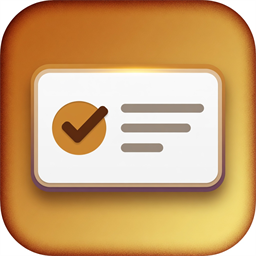

<p align="center">
  
</p>

# FuzzyToast

Toast notifications for **Windows Forms** on **.NET Framework 4.6.1+** and **.NET 8+**.

[](https://github.com/anhquoctran/FuzzyToast/actions/workflows/ci.yml)
[](https://www.nuget.org/packages/FuzzyToast)
[](https://github.com/anhquoctran/FuzzyToast/blob/master/LICENSE)
[](https://github.com/anhquoctran/FuzzyToast#tests--coverage)

```csharp
using FuzzyToast;

Toast.Build(this, "Hello, I am Toast!").Show();
```

```bash
dotnet add package FuzzyToast
```

## Why FuzzyToast

| | |
|--|--|
| **Android-style API** | `Toast.Build(owner, "…").Show()` |
| **Two runtimes** | `net461` and `net8.0-windows` in one package |
| **Four corners** | TopLeft, TopRight, BottomLeft, BottomRight |
| **Inputable toasts** | Text box + Submit, stays open until the user acts |
| **DPI-aware** | Scales from the owner form’s `DeviceDpi` |
| **Tested** | xUnit + Coverlet, line coverage **≥ 95%** |

## Requirements

- Windows 10 (1809+) or Windows 11
- .NET Framework **4.6.1+** or .NET **8+**
- Windows Forms (`UseWindowsForms`)

## Next

- [Install and first toast](getting-started.md)
- [API reference](api-reference.md) — every public type and member
- [Migrate from 1.x](migration.md)
- [v2 design notes](design.md)
